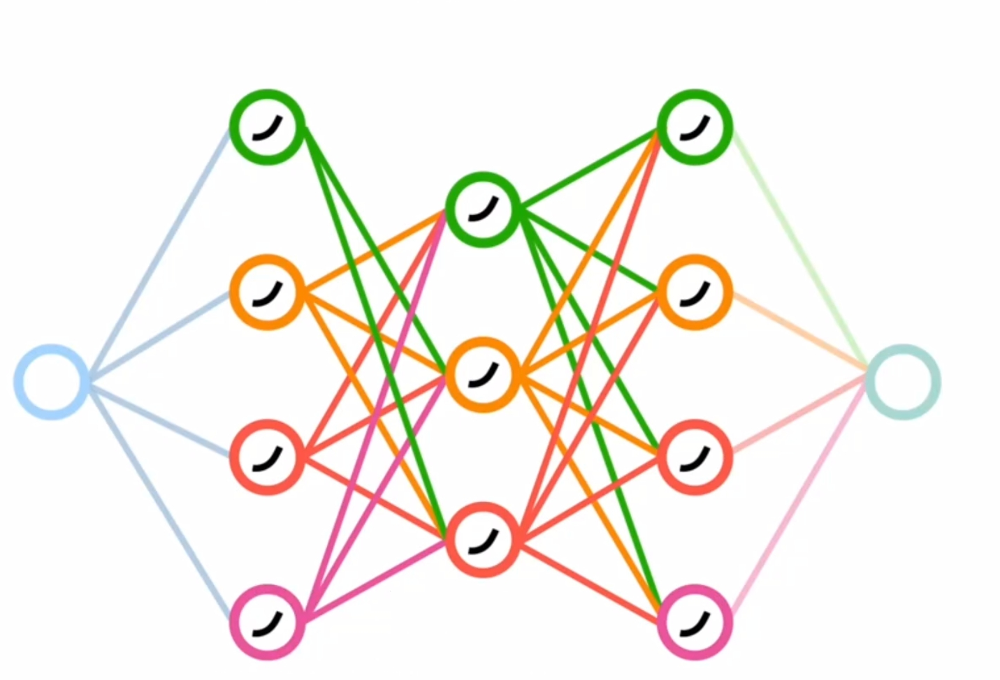
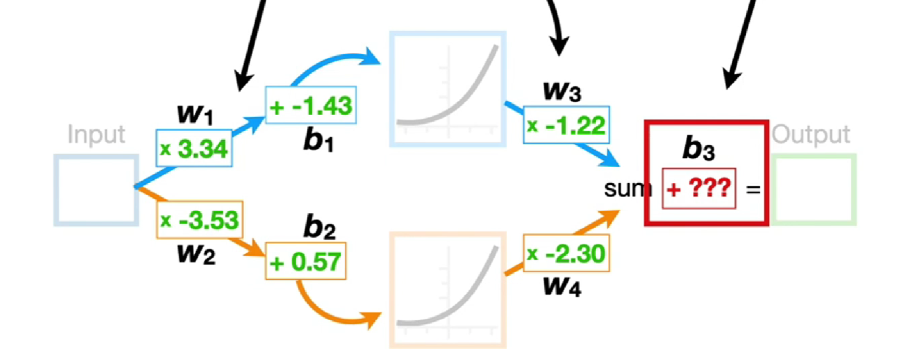

# Deep Learning

[TOC]

## Neural Network Part 1: Inside the black box

### What Is Neural Network?

- a neural network consists of nodes and connections between the nodes.

  [^nodes]: include Hidden Layer nodes ,input nodes ,output nodes .

  - the numbers along  each connection represent parameter values that were estimated when this neural network was fit to the data.
  - using **back propagation**(BP) to estimate unknown parameter values.

#### Activation Function

- to build blocks for fitting a squiggle to data.

- type of function

  - ReLU

  - SoftPlus(soft ReLU)

  - sigmoid

#### Hidden Layer

- layer between the input and output nodes.

#### NOTE

- approximately like a big fancy squiggle fitting machine
  - nodes are like neurons
  - connection are sort of like synapses

#### Name

- the parameters that we multiply are called weights - $w$

- the parameters that we add are called biases

### The Chain Rule

e.g. use weight measurements to predict height and to predict shoe size

#### essence of the chain rule

$$
\frac{dSize}{dWeight}=\frac{dSize}{dHeight}\times\frac{dHeight}{dWeight}
$$

- the chain rule applies to the residual sum of squares(残差平方和).

### Gradient Descent

- identifies the **optimal value** by taking big steps when it is far away and small steps when it is close.

  e.g. find the optimal value for the intercept( the original line with the intercept equals 0).(构建函数截距和残差平方和之间的函数，求导求出最小值)

  - First: find the relation between intercept and sum of squared residuals.(use sum of squared residuals)

  $$
  \frac{d}{d\space intercept} loss = \sum\limits_{i=1}^{k} \frac{d}{d\space intercept}(observed\space height_i-(intercept+slope_i\times weight_i))
  $$

  - Second: update step size to close 0
    - gradient descent determines the **step size** by multiplying the **slope** by a small number called the **learning rate**.
    - new intercept(original intercept is 0) is the old intercept minus the step size.(斜率一开始是不断趋近于0，步长越短)

  - Final: stop updating when number of updating over 1000

  this operation also can be used to find the optimal value of slope.

- to save time facing lots of points, there is a thing called **stochastic gradient decent**(随机梯度下降),that uses a **randomly selected subset** of the data at **every step**.

## Neural Network Part 2: Backpropagation Main Ideas

### Using the Chain Rule to calculate derivatives

- assume only the value of final bias isn't sure, create the relation function and calculate the derivative.

  - $$
    SSR=\sum \limits_{i=1}^{n=k} (Observed_i-Predicted_i)^2
    $$

- using chain rule to derive SSR with respect to Predicted.

  - $$
    \frac{d\space SSR}{d\space b_3}=\sum \limits_{i=1}^{n=3}-2\times (Observed_i-Predicted_i)\times 1
    $$

- using gradient descent and value of derivative determine step size, find the optimal value. 

### Backpropagation Details Part 1

- **How the chain rule and gradient descent apply to multiple parameters**

------

- **some expression :**
  - 1 in $x_{1,i}$​​ refers to the activation function(1 th activation function) in the top node
  - $i$ in $x_{1,i}$ shows us that it corresponds to $input_i$
